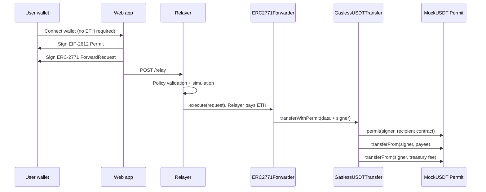

# Gasless mUSDT / ERC-2771

一个面向 Sepolia 的完整 Gasless Transfer 示例：

- 用户钱包只需要持有 `mUSDT`，不需要持有 Sepolia ETH。
- 用户签署一次 EIP-2612 Permit 和一次 ERC-2771 ForwardRequest。
- Relayer 校验、模拟并提交交易，支付 Sepolia Gas。
- `GaslessUSDTTransfer` 将 mUSDT 发送给收款人，并把用户签署的服务费发送到固定 Treasury。

> 这是测试网参考实现，尚未经过第三方安全审计，不应用于承载真实资产。

## 架构



### 合约

- `MockUSDT`: 6 位小数、支持 EIP-2612 Permit，仅用于 Sepolia 演示。
- `GaslessForwarder`: 未修改转发逻辑的 OpenZeppelin `ERC2771Forwarder` 子类，固定 EIP-712 名称。
- `GaslessUSDTTransfer`: 固定 Token、Forwarder 和 Treasury；费用上限为转账金额的 5%。

### Go / Gin Relayer

后端使用 Go + Gin，链上交互使用 go-ethereum。前端继续使用 Vite + TypeScript + viem，原有 HTTP 接口和签名结构保持兼容。

```text
apps/relayer/
  main.go                       # 配置、启动校验、HTTP 服务与优雅退出
  internal/relay/
    config.go                   # .env、地址、私钥、限额与代理配置
    request.go                  # 严格 JSON 校验，uint256 / uint48 转换
    policy.go                   # 固定目标、函数、金额、费用和有效期策略
    abi.go                      # Forwarder 和业务合约 ABI
    ethereum.go                 # eth_call、Gas 估算、签名广播、等待回执
    server.go                   # Gin 路由、CORS、IP 限流、串行提交
    *_test.go                   # Go 策略和接口测试
  test/e2e.ts                   # viem → Go → 本地链合约的端到端测试
```

完整流程与运行方式见 [Go Relayer 说明](docs/go-gin-relayer.md)。

### Relayer 安全策略

Relayer 不接受任意调用，只赞助同时满足以下条件的请求：

- `chainId` 为 Sepolia。
- `to` 必须是已配置的 `GaslessUSDTTransfer`。
- 函数必须是 `transferWithPermit`。
- `value` 必须为 0。
- Gas、金额和有效期必须在服务器限额内。
- 服务费必须等于当前服务器报价。
- Permit 有效期不能早于 ForwardRequest。
- OpenZeppelin Forwarder 的 `verify` 返回 `true`。
- 写链前通过 `eth_call` 完整模拟。

Relayer 在单进程内串行提交，结合 pending Nonce 与已广播 Nonce 的内存记录减少交易 Nonce 冲突，并包含基础 IP 频率限制。该队列不协调多个进程；同一个 Relayer 钱包应仅由一个实例发送交易。生产环境仍应在网关层增加持久化限流、用户配额、监控和告警。

## 为什么不能直接使用任意 USDT

ERC-2771 只能为“信任该 Forwarder 的目标合约”恢复原始调用者，不能修改一个既有 ERC-20 合约的 `msg.sender` 语义。

如果用户持有的 Token：

1. 不支持 EIP-2612 Permit；并且
2. 用户没有事先授权业务合约；

那么业务合约无法从用户 EOA 转出 Token。用户第一次授权仍需要 Gas。

本项目使用支持 Permit 的 `MockUSDT` 解决测试网首次授权问题。迁移到真实资产时，可以选择：

- 使用原生支持 EIP-2612 或 EIP-3009 的 Token；
- 接受一次性的预授权交易；
- 使用已经预授权的 Permit2；
- 改用 ERC-4337 Smart Account + Paymaster。

## 本地安装

要求 Node.js 22.13 或更高版本，以及 Go 1.25 或更高版本。Node.js 用于前端、合约开发和端到端测试；编译后的 Go Relayer 可独立运行。

```bash
npm install
go mod download
cp .env.example .env
npm run compile
npm test
```

测试覆盖以下关键路径：

- 用户不支付 ETH，mUSDT 与服务费正确到账。
- Forwarder Nonce 防止签名重放。
- 攻击者不能从直接调用中盗用他人的 Permit。
- 链上 5% 费用上限。
- 过期请求和非信任目标拒绝。
- Relayer 固定目标、固定函数、零原生 Value、Gas、金额、费用和有效期策略。
- Go HTTP 格式校验、CORS、IP 限流、串行提交，以及回滚、确认超时等错误响应。

## 部署到 Sepolia

### 1. 准备账户

需要两个有少量 Sepolia ETH 的服务器侧账户：

- `SEPOLIA_PRIVATE_KEY`: 部署合约。
- `RELAYER_PRIVATE_KEY`: 持续为用户交易支付 Gas。

建议使用不同账户，并且不要把私钥写入前端或提交到 Git。

### 2. 配置部署参数

在 `.env` 中填写：

```dotenv
SEPOLIA_RPC_URL=https://ethereum-sepolia-rpc.publicnode.com
SEPOLIA_PRIVATE_KEY=0x...
TREASURY_ADDRESS=0x...
DEMO_USER_ADDRESS=0x...
```

### 3. 部署并初始化演示余额

```bash
npm run deploy:sepolia
```

脚本会部署三个合约，并可向 `DEMO_USER_ADDRESS` 铸造 1,000 mUSDT。把输出地址写回 `.env`：

```dotenv
TOKEN_ADDRESS=0x...
FORWARDER_ADDRESS=0x...
RECIPIENT_ADDRESS=0x...
```

后续单独给演示用户补充 mUSDT：

```bash
npm run mint:sepolia
```

## 启动应用

在项目根目录运行。终端一启动 Go 后端：

```bash
npm run relayer
```

该命令等价于 `go run ./apps/relayer`，沿用现有 `.env`，无需迁移钱包或重新部署合约。默认端口仍为 `8787`。

编译独立程序：

```bash
npm run relayer:build
```

输出为 Windows 的 `dist/relayer/relayer.exe`，或 Linux/macOS 的 `dist/relayer/relayer`。从项目根目录启动以读取 `.env`；从其他目录启动可设置 `RELAYER_ENV_FILE` 指向配置文件。

终端二：

```bash
npm run web
```

浏览器打开 `http://localhost:5173`，切换到 Sepolia，连接 `DEMO_USER_ADDRESS` 对应的钱包即可测试。用户可以保持 0 ETH。

Relayer API：

- `GET /health`: 链 ID、Relayer 地址和 ETH 余额。
- `GET /config`: 前端所需合约地址和策略。
- `GET /quote?amount=<token-base-units>`: 费用、Gas 与过期时间。
- `POST /relay`: 校验并提交签署后的 ForwardRequest。

`/relay` 成功返回 `transactionHash`、`status: "success"` 和字符串 `blockNumber`。链上回滚返回 HTTP 422；广播结果不确定或回执不可用返回 HTTP 502/504，并附带可查询的交易哈希。模拟失败不会广播交易。

## 配置单位

MockUSDT 使用 6 位小数：

- `RELAYER_FEE_USDT=10000` 表示 0.01 mUSDT。
- `RELAYER_MAX_AMOUNT=100000000000` 表示 100,000 mUSDT。
- 单笔服务费还必须满足链上 `fee <= amount * 5%`。

## 验证

```bash
npm run typecheck
npm test
npm run test:relayer:e2e
npm run web:build
go vet ./apps/relayer/...
npm audit --omit=dev
```

`npm test` 运行合约测试和 Go 测试。端到端测试会临时启动仅监听本机的 Hardhat 链与 Go 服务，部署测试合约，并检查零 ETH 用户转账、服务费、签名重放、模拟失败和并发 Nonce。该测试不使用 `.env` 中的私钥，也不发送真实 Sepolia 交易。

`npm audit` 只覆盖 JavaScript 依赖；Go 依赖由根目录的 `go.mod` / `go.sum` 锁定。生产 Relayer 镜像只需 Go 可执行文件及运行配置。

## 生产化清单

- 对合约进行独立审计与 Sepolia 长时间演练。
- Relayer 私钥放入 KMS/HSM，不使用明文 `.env`。
- 分离合约开发、Relayer 与静态前端的生产镜像。
- 使用 Redis/数据库保存限流、请求状态和幂等键。
- 为 Relayer ETH 余额、失败率、Nonce 卡住和异常 Gas 消耗配置告警。
- 在反向代理配置 TLS、请求体限制、CORS 和 DDoS 防护。
- 配置 `RELAYER_TRUSTED_PROXIES` 为实际代理 IP/CIDR；默认不信任 `X-Forwarded-For`。
- 固定并验证合约字节码、OpenZeppelin 版本和部署地址。
- 确认目标真实 Token 的 Permit/Authorization 能力，不要仅依据名称或符号判断。
