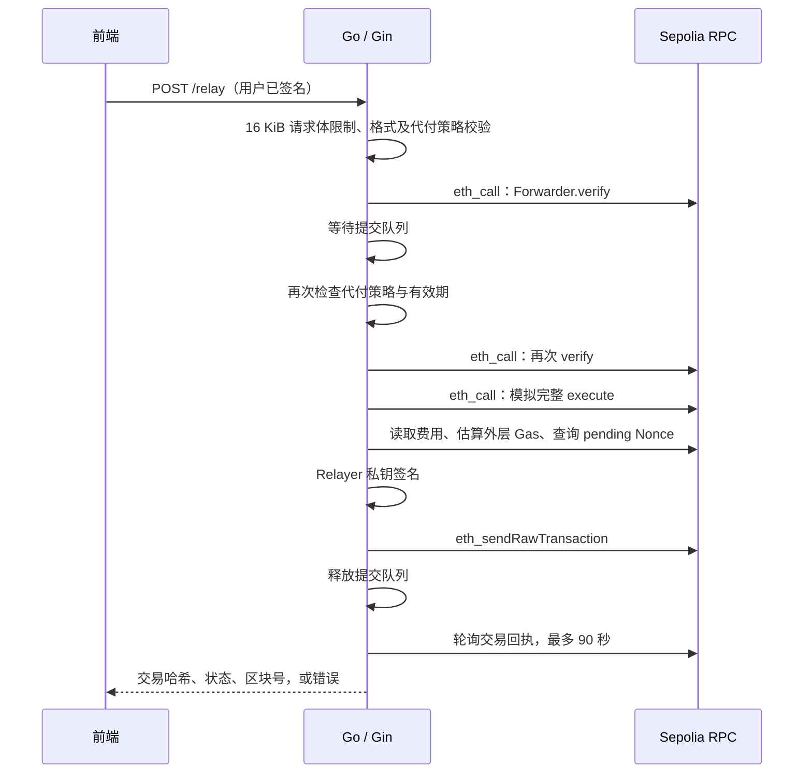

# Go + Gin Relayer

Relayer 已从 TypeScript / Express 迁移为 Go / Gin。Solidity 合约、前端的两次 EIP-712 签名和四个 API 路径保持兼容。链交互使用 go-ethereum，配置继续读取项目根目录 `.env`。

## 启动与编译

需要 Go 1.25+。从项目根目录运行：

```bash
go mod download
go run ./apps/relayer
```

也可以使用 `npm run relayer`。后端默认监听 8787，前端仍通过 `npm run web` 启动。

```bash
npm run relayer:build
```

独立可执行文件输出至 `dist/relayer/`。Windows 文件名为 `relayer.exe`，Linux/macOS 为 `relayer`。可执行文件不依赖 Node.js。

程序默认从工作目录读取 `.env`。也可以设置 `RELAYER_ENV_FILE` 为配置文件路径。进程环境变量优先于文件内容。现有 `SEPOLIA_RPC_URL`、`RELAYER_PRIVATE_KEY`、三个合约地址及费用限额继续有效。`RELAYER_TRUSTED_PROXIES` 是新增的可选配置，默认不信任代理头。

启动时检查 RPC Chain ID 为 11155111、三个地址存在合约代码，以及业务合约的 Token 和 Trusted Forwarder 与配置一致。这是连接与配置核验，不是字节码审计。

## 代码位置

| 文件 | 职责 |
| --- | --- |
| [main.go](../apps/relayer/main.go) | 创建客户端、启动 Gin、设置超时与关闭服务 |
| [config.go](../apps/relayer/internal/relay/config.go) | 配置读取、私钥与地址校验、大整数配置 |
| [request.go](../apps/relayer/internal/relay/request.go) | 严格请求结构、十六进制数据、uint256 和 uint48 校验 |
| [policy.go](../apps/relayer/internal/relay/policy.go) | 代付范围、金额、费用、有效期校验 |
| [abi.go](../apps/relayer/internal/relay/abi.go) | ABI 定义，需与 shared/contracts.ts 和合约同步 |
| [server.go](../apps/relayer/internal/relay/server.go) | HTTP 路由、中间件、串行发送与响应 |
| [ethereum.go](../apps/relayer/internal/relay/ethereum.go) | RPC、模拟、Gas 估算、Nonce、签名与广播 |

## POST /relay 的完整流程



HTTP 中 `value`、`gas`、金额和费用保持十进制字符串，避免 JavaScript Number 精度损失。ForwardRequest 的 `deadline` 仍为 JSON 数字，限定在 uint48 范围。Go 内部用 `math/big.Int` 表达 Solidity 大整数，金额按 6 位小数处理。

内层 `request.gas` 是业务合约调用预算。Go 使用 `eth_estimateGas` 估算整笔 Forwarder 交易，并加入余量，不能把内层预算直接作为外层交易 Gas 上限。支持 EIP-1559；无 Base Fee 的链环境使用 legacy 费用格式。

私钥只在服务端用于本地签名，RPC 接收的是已签名交易。模拟阶段不会广播交易或保存状态，模拟通过也不保证后续打包成功。

## API 和错误响应

| 路径 / 情况 | 行为 |
| --- | --- |
| GET /health | 返回链 ID、Relayer 地址和 ETH 余额 |
| GET /config | 返回地址、签名域名称、费用与限额，数字字符串格式兼容原前端 |
| GET /quote?amount=… | 检查金额及 5% 费用上限，报价有效期为 10 分钟 |
| POST /relay 成功 | HTTP 200，`transactionHash`、`status: "success"`、字符串 `blockNumber` |
| 格式、策略、签名无效 | HTTP 400，格式错误包含 `details` |
| 请求体超过 16 KiB | HTTP 413 |
| 每 IP 每分钟超过 30 次 | HTTP 429 |
| 模拟失败等广播前错误 | HTTP 500；不会因模拟失败消耗 Gas |
| 已确认链上回滚 | HTTP 422，附交易哈希、`status: "reverted"` 和区块号 |
| 广播结果不确定或回执 RPC 错误 | HTTP 502，附已知交易哈希 |
| 确认超时 | HTTP 504，附已广播交易哈希 |

非 2xx 响应沿用前端现有的错误显示流程，因此链上回滚不会被前端展示为成功。哈希在错误 JSON 中保留；当前前端只显示 `error` 文本，完整哈希也可在响应和后端日志中查询。

## 并发与部署限制

- 提交阶段在单进程内串行，等待回执在队列外进行。
- 发送时读取账户 pending Nonce，同时记录本进程成功广播后的下一个 Nonce，减少 RPC 状态滞后造成的重复使用。
- 同一 Relayer 钱包应由一个实例独占发送；内存锁和 Nonce 记录不支持跨进程协调。
- IP 限流为内存实现，重启后清空，并定期按访问清理过期窗口。多实例环境应使用网关或共享存储。
- 代理 IP/CIDR 必须显式配置；CORS 仅控制浏览器跨域访问，不是身份认证。
- 尚无持久化请求状态和幂等键。广播或确认超时后应先查交易哈希；不要自动重新签署并重复发送。

## 验证

```bash
npm test
npm run test:relayer:e2e
npm run typecheck
npm run web:build
go vet ./apps/relayer/...
```

Go 单元测试使用内存 HTTP 请求和模拟后端，覆盖请求校验、策略拒绝、接口兼容、限流、队列串行、回执回滚和超时等分支。

端到端测试使用本机临时 Hardhat 链、随机生成的测试钱包和真实合约，实际验证 viem 签名经 Go ABI 编码后的可执行性、EIP-1559 交易、代币和服务费到账、重放拒绝、模拟失败不消耗 Nonce，以及并发提交。测试配置的 Chain ID 与 Sepolia 相同以验证签名域，RPC 始终指向本机，不连接真实 Sepolia。

参考：[Gin 文档](https://gin-gonic.com/en/docs/)、[go-ethereum Go API](https://geth.ethereum.org/docs/developers/dapp-developer/native)。
